<p align="center">
  <a href="http://nestjs.com/" target="blank"></a>
</p>

[circleci-image]: https://img.shields.io/circleci/build/github/nestjs/nest/master?token=abc123def456
[circleci-url]: https://circleci.com/gh/nestjs/nest

  <p align="center">A progressive <a href="http://nodejs.org" target="_blank">Node.js</a> framework for building efficient and scalable server-side applications.</p>

## Description

API Rest excersice  with <a href="http://nodejs.org" target="_blank">Node.js</a>.

## Environments variables
   - First, it's recommendable create a .env file in the root project.
   - The file must contain the following variables:

```
# ENVIRONMENTS VARIABLES

# Environments
NODE_ENV=development
PORT=3000

# Database credentials
DB_SERVER=gapsi-1.c1ows4mwwr3i.us-east-2.rds.amazonaws.com
DB_PORT=1433
DB_USER=admin
DB_PASSWORD=n6Io64fYxGlXzM6Hi1zQ
DB_NAME=gapsi
```

## Installation

After clone the repository you must navigate it in the root project an execute the following command:

```bash
$ npm install
```

## Running the app

```bash
# development
$ npm run start

# watch mode
$ npm run start:dev

# production mode
$ npm run start:prod
```

## Test

```bash
# unit tests
$ npm run test

# e2e tests
$ npm run test:e2e

# test coverage
$ npm run test:cov
```

## Open API

After run the project you must navigate in the API Restful documentation in the following link: [api documentation](http://localhost:3000/documentation), here you can find all the available services step by step to running it.

## Open API - catalogs examples

* In the <strong>main page</strong> you will find a screen like this:

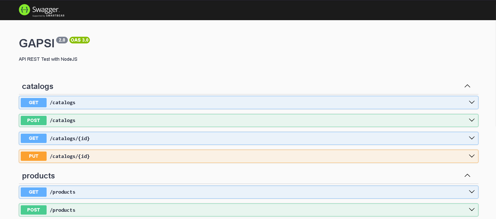

- We will create a new catalog.

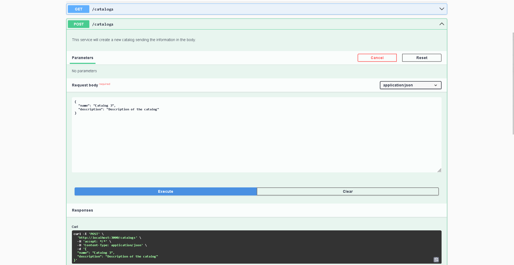

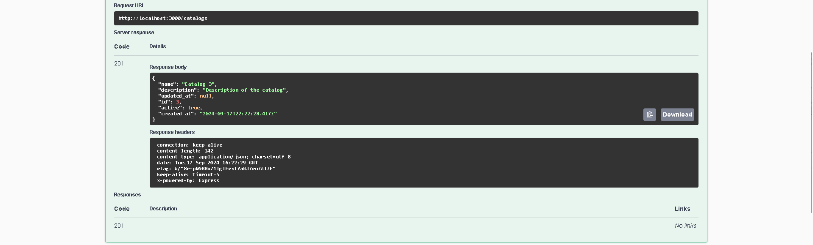

- Next, we will retrieve the catalogs in the database:

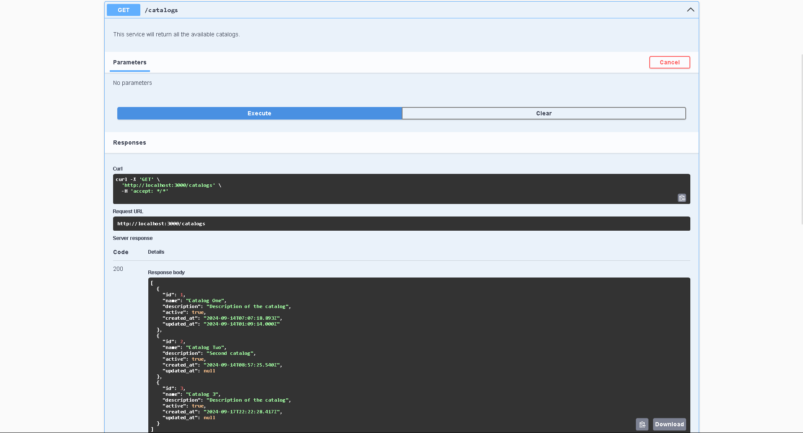

- Now, we will retrieve the single catalog information:

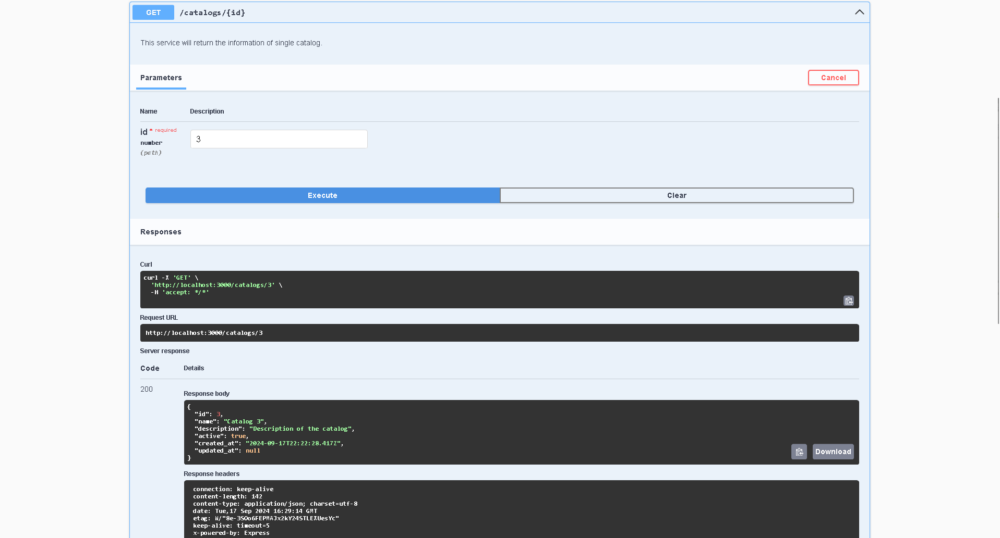

- And finally we will update a single catalog:

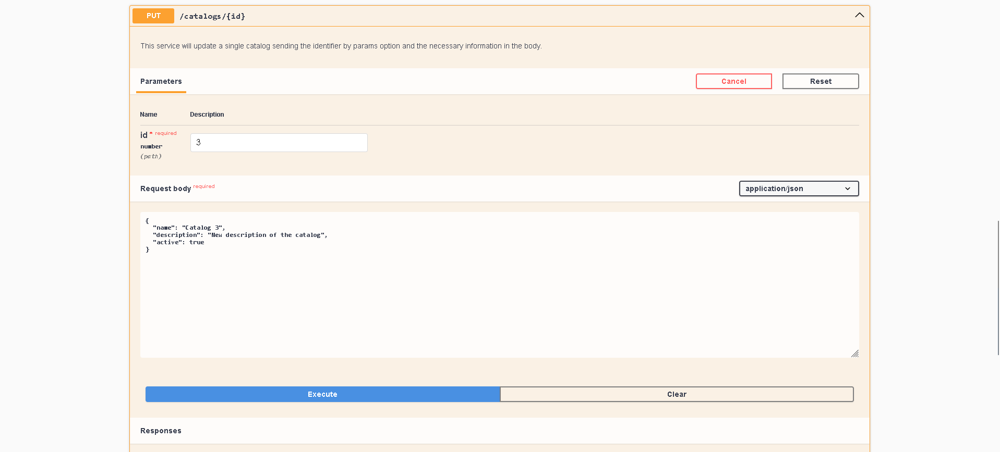

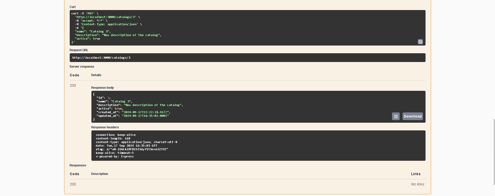

## Open API - products examples

- Creating a new product:

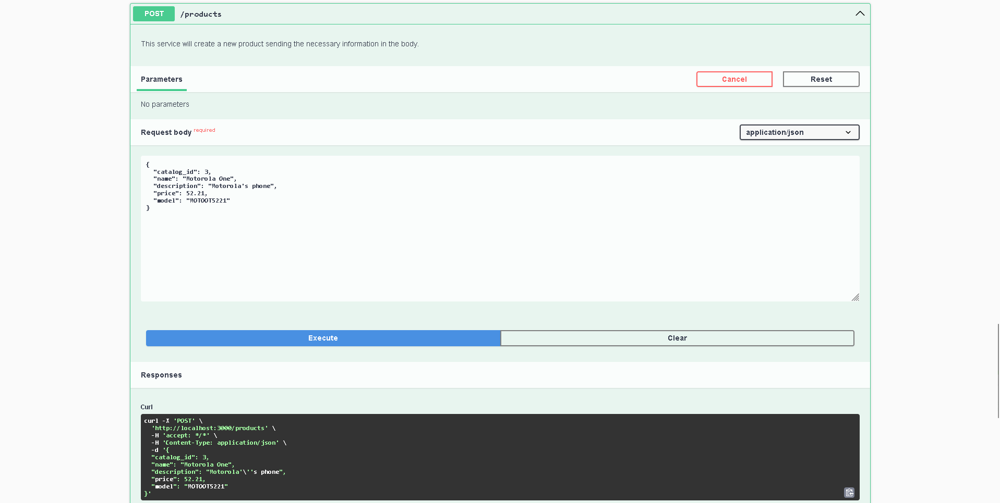

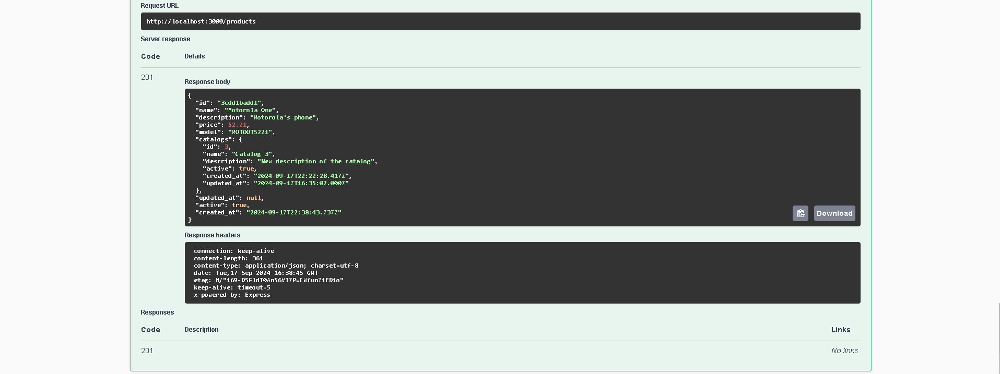

- Next, we will retrieve all the products:

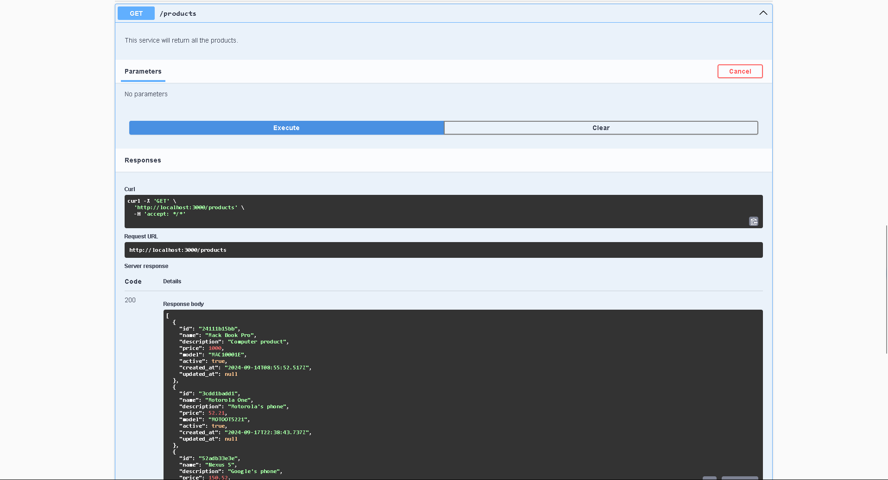

- Now, we will retrieve the single product information:

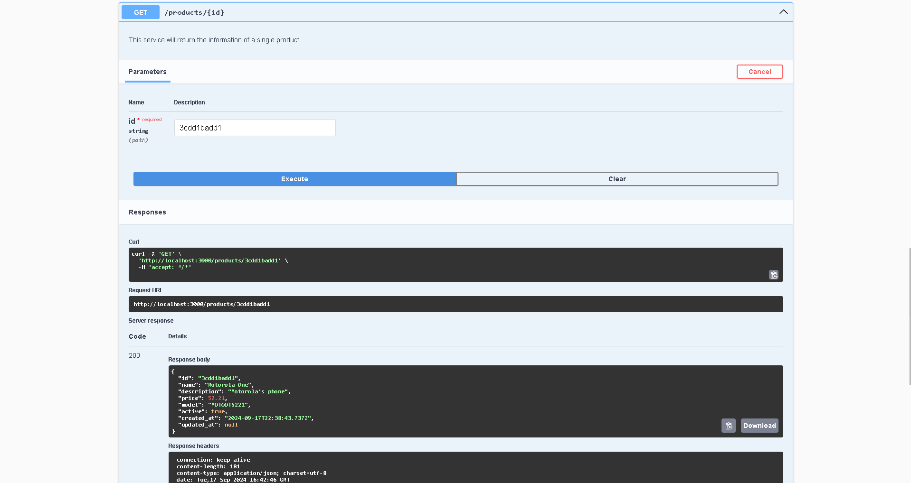

- Finally we will update a single product:

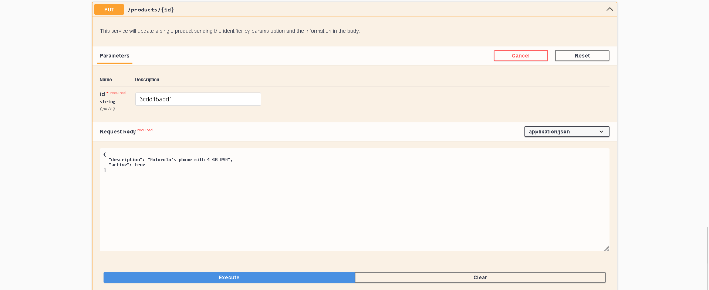

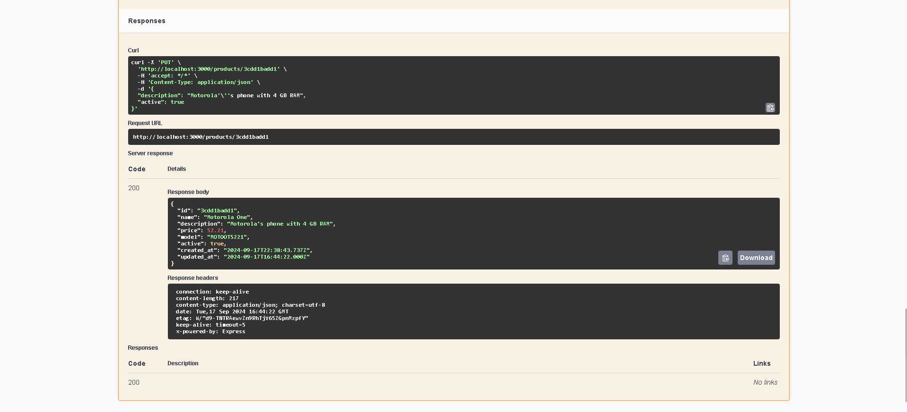

## AWS Services

- We use a Amazon RDS database with SQL Server to save the <strong>catalogs</strong> and <strong>products</strong>.

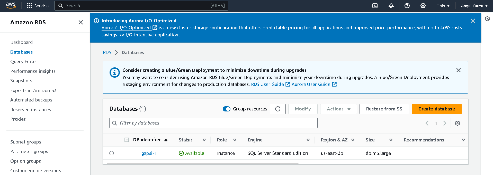

## Stay in touch

- Author - Jose Cantu
- LinkedIn - https://www.linkedin.com/in/jacantual

## License

Nest is [MIT licensed](LICENSE).